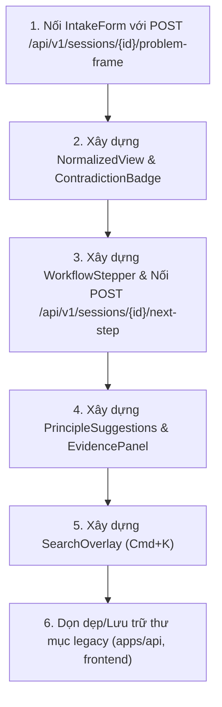

# GAP ANALYSIS & SYSTEM COMPLETENESS AUDIT
**Dự án:** Creative Research Workbench (CRW)  
**Ngày đánh giá:** 2026-09-30  
**Trạng thái kiểm tra:** Hoàn tất kiểm tra mã nguồn, cấu trúc thư mục, tài liệu đặc tả, tests và build/type-check.

---

## 1. Phạm vi & Phương pháp kiểm tra

### 1.1. Tài liệu đối chiếu (Canonical Specs)
1. [`README.md`](file:///Users/mr.chem/Documents/Lap-trinh/creative-research-workbench/README.md)
2. [`docs/PRODUCT_SPEC.md`](file:///Users/mr.chem/Documents/Lap-trinh/creative-research-workbench/docs/PRODUCT_SPEC.md)
3. [`docs/ADR-001-architecture.md`](file:///Users/mr.chem/Documents/Lap-trinh/creative-research-workbench/docs/ADR-001-architecture.md)
4. [`docs/DOMAIN_SCHEMA.md`](file:///Users/mr.chem/Documents/Lap-trinh/creative-research-workbench/docs/DOMAIN_SCHEMA.md)
5. [`docs/API_CONTRACTS.md`](file:///Users/mr.chem/Documents/Lap-trinh/creative-research-workbench/docs/API_CONTRACTS.md)
6. [`docs/IMPLEMENTATION_ROADMAP.md`](file:///Users/mr.chem/Documents/Lap-trinh/creative-research-workbench/docs/IMPLEMENTATION_ROADMAP.md)
7. [`docs/GHERKIN_SCENARIOS.md`](file:///Users/mr.chem/Documents/Lap-trinh/creative-research-workbench/docs/GHERKIN_SCENARIOS.md)
8. [`docs/UI_MODULE_BREAKDOWN.md`](file:///Users/mr.chem/Documents/Lap-trinh/creative-research-workbench/docs/UI_MODULE_BREAKDOWN.md)
9. [`docs/definition-of-done.md`](file:///Users/mr.chem/Documents/Lap-trinh/creative-research-workbench/docs/definition-of-done.md)

### 1.2. Mã nguồn được kiểm tra
- `backend/` (FastAPI + SQLAlchemy + pgvector + Services + Integration Tests)
- `apps/api/` (Legacy prototype)
- `apps/web/` (Next.js 14 App Router + Tailwind + TanStack Query + Zustand)
- `frontend/` (Legacy Vite prototype)

---

## 2. Kiến trúc thực tế & Source of Truth

| Thành phần | Thư mục Source of Truth (Canonical) | Thư mục Legacy / Trùng lặp (Cần dọn dẹp) | Bằng chứng kỹ thuật |
| :--- | :--- | :--- | :--- |
| **Backend** | [`backend/`](file:///Users/mr.chem/Documents/Lap-trinh/creative-research-workbench/backend) | [`apps/api/`](file:///Users/mr.chem/Documents/Lap-trinh/creative-research-workbench/apps/api) | `backend/` có đầy đủ SQLAlchemy ORM, pgvector, 5 core services (`ingestion`, `retrieval`, `problem_structuring`, `method_recommender`, `workflow_engine`), REST API routers và integration tests. `docker-compose.yml` build trực tiếp từ `./backend`. `apps/api/` chỉ chứa Pydantic in-memory models sơ khai. |
| **Frontend** | [`apps/web/`](file:///Users/mr.chem/Documents/Lap-trinh/creative-research-workbench/apps/web) | [`frontend/`](file:///Users/mr.chem/Documents/Lap-trinh/creative-research-workbench/frontend) | `apps/web/` là Next.js 14 App Router với TypeScript, shadcn/ui, Zustand, TanStack Query, Dockerfile riêng, type-check đạt 100%. `frontend/` là Vite SPA skeleton cũ không được bảo trì. |

---

## 3. Bảng đối chiếu tiến độ theo Phase & Specs

### 3.1. Đối chiếu theo Phase Roadmap (`docs/IMPLEMENTATION_ROADMAP.md`)

| Phase | Mục tiêu | Backend Status | Frontend Status | Đánh giá tổng thể |
| :--- | :--- | :---: | :---: | :--- |
| **Phase 0** | Knowledge Inventory & 10 Golden Docs | ✅ ĐẠT | N/A | Hoàn thành 10 golden docs có frontmatter YAML chuẩn. |
| **Phase 1** | Specs & ADR Architecture | ✅ ĐẠT | ✅ ĐẠT | Đầy đủ 100% specs, contracts, schemas, test plans. |
| **Phase 2** | Ingestion & Hybrid Retrieval Pipeline | ✅ ĐẠT | ❌ THIẾU UI | Backend có `IngestionService`, `RetrievalService` (FTS + pgvector RRF), `POST /api/v1/search`. Frontend chưa có Search UI/Evidence Panel. |
| **Phase 3** | Problem Structuring & Contradiction Detection | ✅ ĐẠT | ⚠️ CHƯA NỐI API | Backend có `ProblemStructuringService`, `POST /api/v1/sessions/{id}/problem-frame`. Frontend `intake-form.tsx` chưa gửi API thật. |
| **Phase 4** | Reasoning Workflow & TRIZ Recommender | ✅ ĐẠT | ❌ THIẾU UI | Backend có `WorkflowEngine` (FSM), `MethodRecommender` (TRIZ matrix), `POST /api/v1/sessions/{id}/next-step`. Frontend chưa có stepper/action UI. |
| **Phase 5** | UI Workspace (Screen 1, 2, 3) | N/A | ⚠️ MỚI ĐẠT 35% | Đã hoàn thành Screen 1 (`SessionList` full CRUD/filter/sort). Screen 2 (`ProblemCanvas`) và Screen 3 (`SearchOverlay`) chưa hoàn thiện. |

---

## 4. Chi tiết các phần đã hoàn thành vs chưa hoàn thành

### 4.1. Đã hoàn thành (Completed)
1. **Infrastructure & DevOps:**
   - Docker Compose đa container (`crw_postgres` + `crw_api` + `crw_frontend`).
   - Frontend container build riêng (Node 20 slim), tránh lỗi EIO VirtioFS trên macOS.
   - Database pgvector pg16 đã cấu hình và kết nối an toàn.
2. **Backend (Core Domain & Services):**
   - Data models: `ResearchSession`, `ProblemFrame`, `Contradiction`, `Document`, `Chunk`.
   - `IngestionService`: Parse markdown frontmatter, chunking, SHA256 content hash dedup.
   - `RetrievalService`: Hybrid Full-text search (PostgreSQL tsvector) + Vector semantic search (pgvector cosine distance) với Reciprocal Rank Fusion.
   - `ProblemStructuringService`: Normalization text, rule-based & pattern contradiction extraction (technical / physical).
   - `MethodRecommender`: 40 TRIZ inventive principles mapping.
   - `WorkflowEngine`: FSM 6 stages (`intake` -> `structuring` -> `retrieval` -> `ideation` -> `evaluation` -> `synthesis`).
   - Endpoints: `GET /health`, `GET/POST /api/v1/sessions`, `GET /api/v1/sessions/{id}`, `POST /api/v1/sessions/{id}/problem-frame`, `POST /api/v1/sessions/{id}/next-step`, `POST /api/v1/search`.
3. **Frontend (Session Management - Screen 1):**
   - `apps/web/features/session/session-list.tsx`: Hiển thị danh sách, search realtime, filter trạng thái, sort, tạo session modal, validation.
   - `apps/web/lib/api-client.ts`: Đầy đủ 6 hàm API client typed bằng TypeScript.
   - TypeScript verification: `npm run type-check` PASS (0 errors).

---

## 4.2. Chưa hoàn thành (Gaps to Complete)

### Gap 1: Screen 2 — Problem Canvas (`/sessions/[id]`)
- **Đã hoàn thành ở Phase 5.4, 5.5 & 5.6:**
  1. ✅ Đã fetch session detail thật qua `getSession(sessionId)` bằng `useQuery({ queryKey: ['session', sessionId] })`.
  2. ✅ [`apps/web/features/intake/intake-form.tsx`](file:///Users/mr.chem/Documents/Lap-trinh/creative-research-workbench/apps/web/features/intake/intake-form.tsx) đã nối `useMutation` gọi API `POST /sessions/{id}/problem-frame`.
  3. ✅ Component `NormalizedView`: Đã hoàn thành hiển thị kết quả normalize statement sau khi submit problem frame.
  4. ✅ Component `ContradictionBadge`: Đã hoàn thành hiển thị loại mâu thuẫn (`technical` / `physical`) và cặp thông số cải thiện/suy giảm (`improving_parameter`, `worsening_parameter`).
  5. ✅ Component `WorkflowStepper` (Phase 5.5): Hiển thị tiến trình FSM 6 bước, active/completed states và nút bấm "Chuyển bước tiếp theo" gọi `POST /api/v1/sessions/{id}/next-step`.
  6. ✅ Component `PrincipleSuggestions` (Phase 5.6): Hiển thị danh sách các nguyên tắc sáng tạo TRIZ được gợi ý cho session.

### Gap 2: Screen 3 — Evidence Panel & Search Overlay (`Command Palette / Cmd+K`)
- **Đã hoàn thành ở Phase 5.6 & 5.7:**
  1. ✅ `EvidencePanel` (tab Tài liệu & Bằng chứng): Hiển thị các đoạn trích (excerpts) từ 10 Golden Documents liên quan đến bài toán đang giải quyết với Hybrid Search score.
  2. ✅ `SearchOverlay` (Phase 5.7 - Cmd+K modal): Modal tìm kiếm toàn cục kích hoạt bằng `Cmd+K` / `Ctrl+K`, debounce 300ms, hiển thị trích đoạn tài liệu kèm score % và source_ref trỏ đến tài liệu gốc trong kho TRIZ.

### Gap 3: Thư mục trùng lặp/legacy chưa được cô lập hoặc loại bỏ
- **Đã hoàn thành ở Phase 5.8:**
  1. ✅ Tạo `apps/api/DEPRECATED.md` và `frontend/DEPRECATED.md` để cách ly và cảnh báo rõ ràng các skeleton cũ.
  2. ✅ Cập nhật `README.md` để khẳng định duy nhất 2 nguồn chân lý: `backend/` và `apps/web/`.

---

## 5. Rủi ro kỹ thuật lớn nhất

1. **Rủi ro Không đồng bộ Client-Server State (State Desynchronization):**
   - `ProblemFrame` và `ResearchSession` có mối quan hệ 1-N trong Database nhưng ở màn hình Canvas, người dùng thao tác liên tục giữa Problem Statement và Workflow State. Nếu không quản lý cache React Query / Zustand cẩn thận, UI có thể hiển thị FSM state cũ.
2. **Rủi ro Fallback khi Docker/Database offline trong môi trường dev cục bộ:**
   - Cần đảm bảo `api-client` xử lý graceful degradation khi backend chưa sẵn sàng hoặc trả mã lỗi HTTP 4xx/5xx với thông báo người dùng rõ ràng.
3. **Rủi ro Blast Radius:**
   - Việc nâng cấp Screen 2 (`Problem Canvas`) phải tuân thủ boundary component, không làm ảnh hưởng đến Screen 1 (`SessionList`) đã verified pass.

---

## 6. Đề xuất thứ tự triển khai (Blast Radius: Thấp -> Cao)

