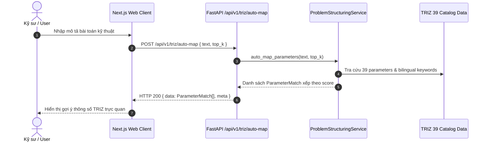

# Phase 10.1 Technical Specification — Full TRIZ 39 Parameters Auto-mapping & Bilingual Intelligence

> **Version:** 1.0.0  
> **Status:** Draft / Active  
> **Date:** 2026-10-02  
> **Scope:** Phase 10.1 of Professional Research Workbench Upgrade Roadmap  

---

## 1. Bối cảnh & Mục tiêu Kỹ thuật

### 1.1 Bối cảnh
Trong các phiên bản trước (Phase 6.3), hệ thống đã tích hợp ma trận Altshuller 39×39 (`triz_matrix_39x39.json`). Tuy nhiên, việc tự động ánh xạ (auto-mapping) từ câu phát biểu bài toán tự nhiên sang đúng các thông số trong 39 thông số Altshuller còn hạn chế về từ vựng song ngữ (Việt - Anh) và chưa có API độc lập cho phép người dùng hoặc UI tra cứu/gợi ý thông số từ đoạn văn bản bất kỳ.

### 1.2 Mục tiêu Phase 10.1
1. **Full 39 Parameters Bilingual Keyword Dictionary**: Mở rộng từ điển từ khóa tiếng Việt & tiếng Anh cho toàn bộ 39 thông số Altshuller với thuật ngữ kỹ thuật chuyên sâu.
2. **Deterministic Auto-mapping Engine**: Xây dựng hàm trích xuất/đánh giá mức độ khớp (scoring) từ văn bản tự nhiên sang danh sách candidate parameters (kèm matched keywords và điểm confidence).
3. **REST API Endpoint**:
   - `POST /api/v1/triz/auto-map`: Nhận chuỗi văn bản tự do, trả về danh sách parameters phù hợp nhất xếp theo điểm tương đồng.
4. **Enhanced Problem Framing**: Đảm bảo `ProblemStructuringService` trích xuất chính xác cả 39 thông số khi nhận diện mâu thuẫn kỹ thuật từ tiếng Việt hoặc tiếng Anh.
5. **Frontend Client & Types**: Cập nhật `types.ts` và `api-client.ts` với method `mapTrizParameters`.

---

## 2. API Contract Specification

### Endpoint: `POST /api/v1/triz/auto-map`

#### Request Body
```json
{
  "text": "Động cơ cần tăng công suất và tốc độ quay nhưng không được làm tăng nhiệt độ và hao mòn cơ học",
  "top_k": 5
}
```

#### Validation Rules
- `text`: Bắt buộc, chuỗi không rỗng (chặn whitespace-only). Nếu rỗng trả về `400 Bad Request`.
- `top_k`: Tùy chọn, integer trong khoảng `[1..39]`, mặc định `5`.

#### Response Body (HTTP 200 OK)
```json
{
  "data": [
    {
      "id": 21,
      "code": "power",
      "name_vi": "Công suất",
      "name_en": "Power",
      "score": 1.0,
      "matched_keywords": ["công suất"],
      "description": "Tốc độ thực hiện công việc..."
    },
    {
      "id": 9,
      "code": "speed",
      "name_vi": "Tốc độ",
      "name_en": "Speed",
      "score": 0.9,
      "matched_keywords": ["tốc độ", "tốc độ quay"],
      "description": "Vận tốc của vật thể..."
    },
    {
      "id": 17,
      "code": "temperature",
      "name_vi": "Nhiệt độ",
      "name_en": "Temperature",
      "score": 0.85,
      "matched_keywords": ["nhiệt độ"],
      "description": "Nhiệt độ của vật thể hoặc môi trường..."
    }
  ],
  "meta": {
    "total_candidates": 3,
    "query_text": "Động cơ cần tăng công suất và tốc độ quay..."
  }
}
```

---

## 3. Architecture & Data Flow



---

## 4. Blast Radius & Invariants
- **Database Schema**: Zero migration, không thay đổi bảng database.
- **Dependencies**: Zero new dependencies.
- **Backward Compatibility**: Giữ nguyên toàn bộ endpoints `/parameters`, `/principles`, `/lookup` và hợp đồng export/import của Phase 9B / 9.3.
