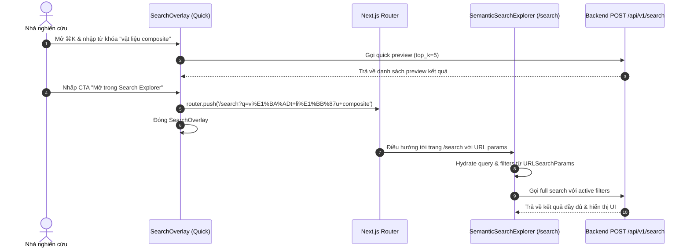

# Phase 10.3 Increment 2 Specification: Unified Search Surface & Explorer Handoff

## 1. Giới Thiệu & Bối Cảnh
Sau khi hoàn thành Phase 10.3 Increment 1 (Xây dựng trang `/search` Semantic Knowledge Base Explorer độc lập và mở rộng filter backend cho `golden` và `source_type`), Increment 2 tập trung vào việc **thống nhất trải nghiệm tìm kiếm (Unified Search Surface)** và thiết lập luồng chuyển tiếp liền mạch (**Explorer Handoff**) giữa Quick Search (`SearchOverlay` - Command-K) và Full Explorer (`SemanticSearchExplorer` tại `/search`).

---

## 2. Mục Tiêu & Nguyên Tắc Cốt Lõi
- **Quick-Search Entry Point (`SearchOverlay`):** Cung cấp khả năng tìm kiếm nhanh tại mọi trang trong ứng dụng qua phím tắt `⌘K` / `Ctrl+K`. Khi người dùng muốn xem kết quả chi tiết, tinh chỉnh bộ lọc sâu hoặc phân tích nâng cao, overlay cung cấp CTA rõ ràng để chuyển sang `/search`.
- **Full Explorer Entry Point (`/search` & `SemanticSearchExplorer`):** Tiếp nhận trạng thái từ URL parameters (`q`, `topic`, `source_type`, `golden`, `phase`, `top_k`), tự động kích hoạt truy vấn và hiển thị kết quả tương ứng. Đồng thời cập nhật URL khi người dùng thay đổi bộ lọc hoặc dọn sạch stale params khi reset.
- **Shared Request Contract & Parameter Serializer:** Chuẩn hóa logic build URL, parse search params và format request payload dùng chung giữa tất cả các search surface.
- **Không phá vỡ tính tương thích:** Giữ nguyên 100% backward compatibility với Increment 1 và backend `POST /api/v1/search`.

---

## 3. Thiết Kế Kiến Trúc & Hợp Đồng Dữ Liệu

### 3.1. Shared Search Utilities (`search-utils.ts`)

```typescript
export interface SearchExplorerState {
  query: string
  topic?: string
  source_type?: string
  golden?: boolean
  phase?: string
  top_k?: number
}

// Chuyển state sang URL query string
export function buildSearchExplorerUrl(state: Partial<SearchExplorerState>): string

// Parse search params từ URLSearchParams sang typed state
export function parseSearchExplorerParams(
  searchParams: URLSearchParams | Record<string, string | string[] | undefined>
): SearchExplorerState

// Chuẩn hóa SearchRequest gửi tới API backend
export function buildSearchPayload(state: SearchExplorerState): SearchRequest
```

### 3.2. URL Query Parameters Mapping
| URL Param | Kiểu dữ liệu | Mô tả | Ví dụ |
| :--- | :--- | :--- | :--- |
| `q` | `string` | Từ khóa / câu hỏi truy vấn | `?q=mâu+thuẫn+kỹ+thuật` |
| `topic` | `string` | Chủ đề tài liệu | `&topic=contradiction` |
| `source_type`| `string` | Loại nguồn tài liệu | `&source_type=golden_kb` |
| `golden` | `boolean` | Chỉ tài liệu chuẩn vàng | `&golden=true` |
| `phase` | `string` | Giai đoạn quy trình | `&phase=solution` |
| `top_k` | `number` | Số lượng kết quả | `&top_k=20` |

---

## 4. Luồng Chuyển Tiếp (Handoff Flow)



---

## 5. UI/UX Interactions & Edge Cases
1. **SearchOverlay CTA:**
   - Hiển thị CTA button ở footer hoặc top bar của kết quả khi `searchTerm.trim()` có độ dài > 0.
   - Text CTA: *"Mở trong Search Explorer"* kèm biểu tượng `ArrowUpRight` hoặc `ExternalLink`.
   - Bấm phím tắt hoặc click chuột sẽ đóng overlay và điều hướng an toàn.
2. **Deep-linking & Bookmarking tại `/search`:**
   - Người dùng truy cập trực tiếp `https://workbench/search?q=triz&golden=true&topic=contradiction` sẽ tự động hiển thị đúng checkbox Golden, dropdown Topic và kết quả tìm kiếm tương ứng mà không cần gõ lại.
3. **Reset Filters:**
   - Bấm nút "Đặt lại" trên Sidebar Filter sẽ xóa toàn bộ query params stale trên URL, đưa về URL `/search` sạch.
