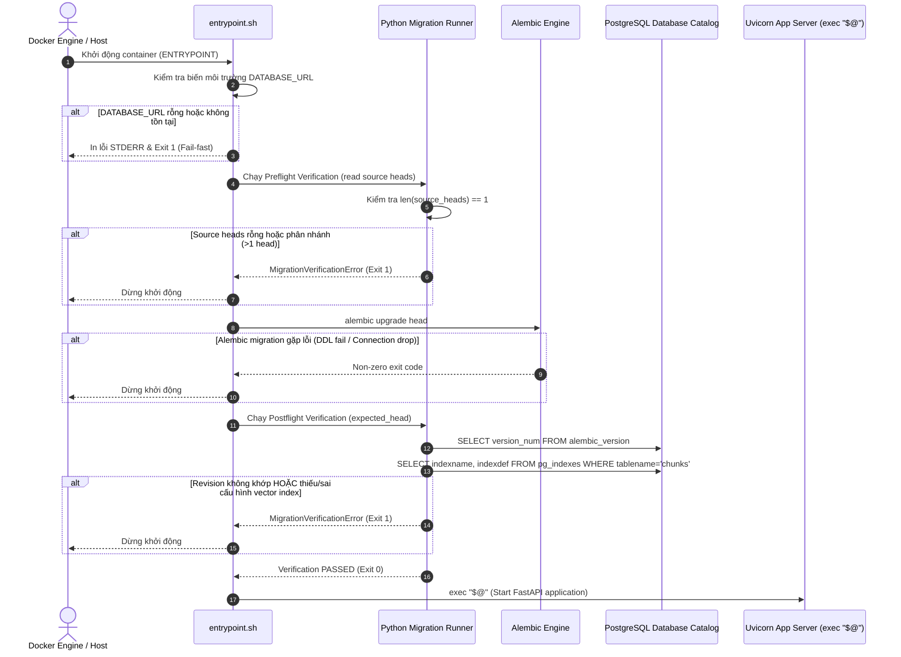

# PHASE 12.1C — RUNTIME STARTUP MIGRATION VERIFICATION & LIFECYCLE WIRING SPECIFICATION

- **Tài liệu:** Đặc tả kỹ thuật & Quy chuẩn tích hợp Runtime Startup Verification
- **Dự án:** Creative Research Workbench
- **Giai đoạn:** Phase 12.1C (Quality & Performance Hardening — Migration Runtime Lifecycle)
- **Tài liệu tham chiếu:** `docs/ADR-003-runtime-startup-migration-verification.md`, `docs/ADR-002-migration-artifact-freshness.md`, `docs/PHASE_12_1A_MIGRATION_ARTIFACT_FRESHNESS_SPEC.md`
- **Kỷ luật áp dụng:** First-Principles Thinking, Spec-first, Test-first, Fail-closed Safety Guard, Non-hardcoded Lineage

---

## 1. Mục tiêu Phase

1. **Tích hợp (Wiring) Runtime Verification vào Luồng Khởi động Container (Startup / Release Path):**
   Kết nối module `app.infrastructure.migrations.runtime_verification` vào tiến trình khởi chạy của backend container (`entrypoint.sh` / Python orchestration runner).
2. **Loại bỏ trạng thái "Success giả tạo" (False Sense of Success):**
   Ngăn chặn ứng dụng FastAPI/Uvicorn khởi động khi quá trình migration chưa thực thi đầy đủ, gặp lỗi ngầm, hoặc schema thực tế của cơ sở dữ liệu bị sai lệch (drift) so với mã nguồn repository.
3. **Thiết lập cơ chế Chặn an toàn (Fail-closed Gate):**
   Nếu bất kỳ bước nào trong chuỗi kiểm tra (Preflight, Migration Execution, Postflight Catalog Verification) thất bại, tiến trình container phải dừng ngay lập tức với exit code khác `0` và ghi nhận log chi tiết.

---

## 2. Hiện trạng (Current State Analysis)

1. **`backend/entrypoint.sh` hiện tại:**
   - Kiểm tra biến môi trường `DATABASE_URL` (nếu thiếu hoặc rỗng -> `exit 1`).
   - Chạy lệnh `alembic upgrade head`.
   - Thực thi trực tiếp lệnh khởi động ứng dụng: `exec "$@"`.
   - **Hạn chế:** Chỉ dựa vào exit code của lệnh Alembic; không có bước hậu kiểm (postflight) catalog để xác nhận revision thực tế và các cấu trúc quan trọng (như vector index `ix_chunks_embedding_cosine`).
2. **Module `backend/src/app/infrastructure/migrations/runtime_verification.py`:**
   - Đã được xây dựng và kiểm thử hoàn chỉnh trong Phase 12.1B (`read_source_heads`, `read_database_revision`, `verify_preflight`, `verify_postflight`, `MigrationRuntimeSnapshot`, `MigrationVerificationError`).
   - **Hạn chế:** Module đang ở trạng thái độc lập (standalone), chưa được gọi từ tiến trình khởi động của container.
3. **Quy trình CI (`.github/workflows/ci.yml`):**
   - Đã có bước kiểm tra độ tươi mới của migration artifact trong source và Docker image (`Verify source Alembic head`, `Verify backend image migration artifact freshness`).
   - **Hạn chế:** Chưa tích hợp bước kiểm tra thực thi toàn trình (end-to-end runtime postflight) trong kịch bản khởi động container thực tế.

---

## 3. Phạm vi Phase 12.1C (Scope & Boundaries)

### Trong phạm vi (In-Scope):
1. Thiết kế và đặc tả luồng kết hợp (orchestration flow) giữa Shell script khởi động (`entrypoint.sh`) và Python verification logic (`runtime_verification.py`).
2. Định nghĩa quy trình xác định dynamically expected head từ thư mục migration nguồn mà không hardcode revision literal (như `'003'`).
3. Khóa các kịch bản kiểm thử hành vi khởi động (Gherkin Scenarios) từ cấp độ unit orchestration đến container integration test.
4. Lập kế hoạch triển khai test-first (Phase 12.1C.2) và implementation (Phase 12.1C.3).

### Ngoài phạm vi (Out-of-Scope / Non-Goals):
1. **Không thay đổi Business Logic:** Không sửa đổi các service tầng domain hay application (`SearchService`, `RetrievalService`, `SessionService`,...).
2. **Không thay đổi cấu trúc DDL migration:** Giữ nguyên các migration file `001`, `002`, `003` hiện có.
3. **Không tái cấu trúc hạ tầng triển khai (No Deployment Redesign):** Không chuyển đổi orchestrator (Docker Compose sang K8s) hay thay đổi database engine.
4. **Không đưa thêm nền tảng Observability phức tạp:** Giữ log stdout/stderr chuẩn cho container.

---

## 4. Quyết định Đề xuất (Proposed Decisions)

1. **Tự động xác định Expected Head (Dynamic Head Discovery):**
   - Tuyệt đối không hardcode revision number (ví dụ `'003'`) trong script hay lệnh shell.
   - Sử dụng `read_source_heads()` từ module Python để đọc trực tiếp danh sách heads từ thư mục `alembic/versions`.
   - Đảm bảo source migration có chính xác 1 head duy nhất (không phân nhánh không hợp lệ).
2. **Tách biệt Trách nhiệm qua Python Orchestration:**
   - Thay vì viết truy vấn SQL phức tạp hoặc logic parse text trong Shell script, toàn bộ logic kết nối database, đọc catalog PostgreSQL (`pg_indexes`, `alembic_version`), và so khớp schema được đóng gói trong Python runner / CLI entry point.
   - Shell script `entrypoint.sh` chỉ đóng vai trò điều phối môi trường (OS-level entrypoint) và gọi lệnh Python verification.
3. **Kỷ luật Fail-closed nghiêm ngặt:**
   - Nếu `DATABASE_URL` thiếu -> `exit 1`.
   - Nếu `verify_preflight` phát hiện 0 head hoặc > 1 head -> in lỗi -> `exit 1`.
   - Nếu `alembic upgrade head` thất bại -> `exit 1`.
   - Nếu `verify_postflight` phát hiện revision không khớp hoặc thiếu index pgvector -> in lỗi -> `exit 1`.
   - Chỉ khi mọi kiểm tra thành công, lệnh `exec "$@"` mới được thực thi.

---

## 5. Kiến trúc Luồng Khởi động Đề xuất (Startup Execution Sequence)

Luồng tuần tự chi tiết của tiến trình khởi động container backend:



---

## 6. Điểm Nhạy cảm & Đánh giá Rủi ro (Risks & Sensitivity Analysis)

| Điểm nhạy cảm / Rủi ro | Mức độ | Biện pháp giảm thiểu (Mitigation) |
| :--- | :---: | :--- |
| **Độ trễ khởi động (Startup Latency)** | Thấp | Kiểm tra catalog PostgreSQL chỉ tốn ~10–50ms qua kết nối nội bộ, hoàn toàn chấp nhận được so với độ an toàn mang lại. |
| **False Positive (Báo lỗi sai khi DB hợp lệ)** | Trung bình | Module `runtime_verification` đã có unit tests và integration tests bao phủ chặt chẽ điều kiện truy vấn catalog (`ivfflat`, `vector_cosine_ops`). |
| **Cơ sở dữ liệu tạm thời chưa sẵn sàng** | Trung bình | Có thể kết hợp cơ chế kiểm tra kết nối với timeout/retry rõ ràng trước khi nâng cấp. |
| **Rollback Semantics** | Trung bình | Nếu migration hoặc postflight fail giữa chừng, container dừng ngay lập tức, ngăn chặn việc phục vụ traffic với schema hỏng. |

---

## 7. Phân loại Blast Radius (Blast Radius Classification)

- **Tài liệu Spec & ADR (Phase 12.1C.1):** Mức độ rủi ro = **Zero** (Hoàn toàn Reversible).
- **Mã nguồn Lifecycle Wiring (Phase 12.1C.3):** Mức độ rủi ro = **High / Critical (One-way architectural gate)**:
  - Thay đổi trực tiếp hành vi khởi động của container backend.
  - Nếu có lỗi trong verification script, toàn bộ container backend sẽ không thể khởi động (`CrashLoopBackOff` / exit non-zero).
  - **Yêu cầu bắt buộc:** Phải áp dụng quy trình kiểm thử test-first nghiêm ngặt (RED -> GREEN), kiểm tra cả success path lẫn failure paths trước khi merge.

---

## 8. Chiến lược Kiểm thử (Test Strategy)

1. **Unit Tests (Orchestration Runner / CLI Helper):**
   - Mock các trường hợp: source head discovery, argument parsing, engine creation, và handling `MigrationVerificationError`.
2. **Integration Tests (Startup Path Fail-Fast Contract):**
   - Test kịch bản thực thi entrypoint với database thật trong testcontainer.
   - Test kịch bản database thiếu index hoặc ở revision cũ sau migration lỗi -> xác nhận tiến trình dừng ngay lập tức.
3. **Container-level Smoke Test (End-to-End Container Verification):**
   - Kiểm tra container backend build từ Dockerfile khởi động thành công khi DB sẵn sàng và tự động dừng khi DB không đáp ứng điều kiện.

---

## 9. Gherkin Scenarios cho Phase 12.1C

```gherkin
Feature: Runtime Startup Migration Verification and Lifecycle Wiring

  Background:
    Given môi trường container backend đã cài đặt đầy đủ Python runtime và Alembic configuration

  Scenario: 1. Success Path - Single head, migration succeeds, postflight passes, server starts
    Given thư mục migration nguồn có duy nhất 1 head hợp lệ "003"
    And biến môi trường "DATABASE_URL" được thiết lập chính xác
    When container thực thi quy trình khởi động startup
    Then bước preflight xác nhận 1 source head "003"
    And lệnh "alembic upgrade head" nâng cấp database thành công lên revision "003"
    And bước postflight xác nhận revision là "003" và index "ix_chunks_embedding_cosine" (ivfflat, vector_cosine_ops) tồn tại
    And tiến trình chuyển giao quyền thực thi thành công sang app server "exec $@"

  Scenario: 2. Missing DATABASE_URL - Startup fails before migration
    Given biến môi trường "DATABASE_URL" chưa được gán hoặc có giá trị rỗng
    When container thực thi quy trình khởi động startup
    Then hệ thống in thông báo lỗi rõ ràng ra STDERR
    And tiến trình dừng ngay lập tức với exit code khác 0
    And không có lệnh Alembic hay app server nào được khởi chạy

  Scenario: 3. Multiple Divergent Source Heads - Startup fails at preflight
    Given thư mục migration nguồn chứa nhiều hơn 1 head do phân nhánh chưa merge
    When container thực thi bước preflight verification
    Then hệ thống phát hiện divergent heads và báo lỗi "MigrationVerificationError"
    And tiến trình dừng ngay lập tức với exit code khác 0
    And không thực thi lệnh "alembic upgrade head"

  Scenario: 4. Migration Execution Failure - Startup fails after alembic error
    Given database đang ở revision cũ nhưng lệnh "alembic upgrade head" gặp lỗi SQL hoặc mất kết nối
    When lệnh "alembic upgrade head" trả về exit code khác 0
    Then tiến trình khởi động dừng ngay lập tức
    And app server không được khởi chạy

  Scenario: 5. Postflight Revision Mismatch - Startup fails after migration drift
    Given lệnh migration hoàn tất nhưng bảng "alembic_version" không khớp với source head
    When bước postflight verification thực hiện so khớp
    Then hệ thống raise lỗi "MigrationVerificationError" với thông báo drift
    And tiến trình dừng với exit code khác 0
    And app server bị chặn không được khởi chạy

  Scenario: 6. Postflight Missing or Invalid Index - Startup fails on missing vector index
    Given database đã ở revision "003" nhưng index "ix_chunks_embedding_cosine" bị thiếu hoặc sai opclass
    When bước postflight verification kiểm tra PostgreSQL catalog "pg_indexes"
    Then hệ thống raise lỗi "MigrationVerificationError" do thiếu hoặc sai index
    And tiến trình dừng với exit code khác 0
    And app server bị chặn không được khởi chạy
```

---

## 10. Kế hoạch Triển khai (Implementation Roadmap Checklist)

- [ ] **Phase 12.1C.1 (Hiện tại):** Hoàn thành tài liệu đặc tả `PHASE_12_1C_RUNTIME_STARTUP_VERIFICATION_SPEC.md` và `ADR-003-runtime-startup-migration-verification.md`. Dừng xin approval.
- [ ] **Phase 12.1C.2 (Test-First RED):** Viết unit và integration tests kiểm thử logic orchestration startup runner với các kịch bản thành công và fail-fast.
- [ ] **Phase 12.1C.3 (Implementation GREEN):**
  - Xây dựng CLI entrypoint / Python runner (`python -m app.infrastructure.migrations...` hoặc runner tương đương).
  - Tích hợp runner vào `backend/entrypoint.sh`.
  - Chạy toàn bộ test suite để chuyển sang GREEN.
- [ ] **Phase 12.1C.4 (Container Smoke & Verification):** Kiểm tra build Docker image và chạy container thực tế để xác nhận hành vi startup.

---

## 11. Tiêu chí Chấp thuận (Acceptance Criteria)

1. Tiến trình khởi động backend container chỉ tiếp tục chạy app server khi và chỉ khi toàn bộ chuỗi preflight, migration upgrade, và postflight catalog verification thành công.
2. Không chứa bất kỳ giá trị hardcode revision nào trong shell script `entrypoint.sh`.
3. Toàn bộ logic kiểm tra catalog và đối soát revision được quản lý tập trung trong module Python chuyên biệt.
4. Mọi kịch bản lỗi (thiếu biến môi trường, divergent heads, migration fail, schema drift, thiếu index) đều được chứng minh qua kiểm thử tự động là sẽ chặn đứng việc khởi động app server.
