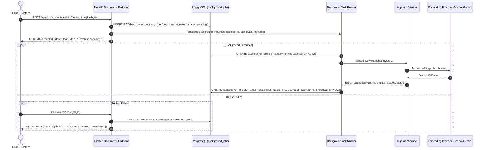
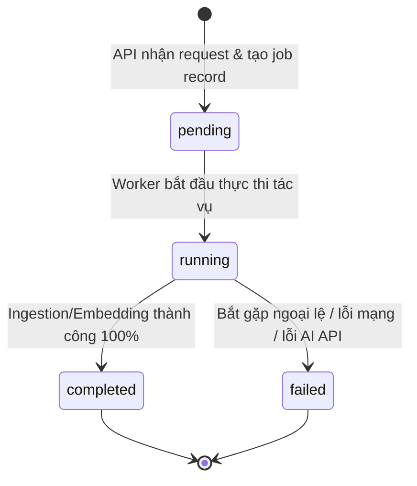

# PHASE 12.2 — ASYNC BACKGROUND PROCESSING & JOB TRACKING SPECIFICATION

- **Tài liệu:** Đặc tả kỹ thuật & Hợp đồng API cho Hệ thống Xử lý Tác vụ Nền Bất đồng bộ (Async Background Processing & Job Tracking)
- **Dự án:** Creative Research Workbench
- **Giai đoạn:** Phase 12.2 (Quality & Performance Hardening — Asynchronous Execution Layer)
- **Tài liệu tham chiếu:** `docs/ADR-004-async-background-processing.md`, `docs/ADR-001-architecture.md`, `docs/PROFESSIONAL_UPGRADE_ROADMAP.md`
- **Kỷ luật áp dụng:** First-Principles Thinking, Test-First (TDD), Fail-Closed & Fail-Visible Error Handling, Session Isolation

---

## 1. Mục tiêu Phase (Phase Goals)

1. **Phi đồng bộ hóa các Tác vụ Nặng (Non-blocking Heavy Workloads):**
   Chuyển các thao tác tốn thời gian (nạp tài liệu kích thước lớn, phân rã chunking, gọi External Embedding API OpenAI/Gemini, hoặc re-embedding toàn bộ Knowledge Base) từ mô hình đồng bộ (blocking HTTP request) sang mô hình phi đồng bộ nền (Background Processing).
2. **Cung cấp Chu kỳ Theo dõi Trạng thái Job Minh bạch (Job Lifecycle & Progress Tracking):**
   Thiết lập bảng lưu trữ và API endpoint cho phép client nhận ngay phản hồi HTTP 202 Accepted kèm `job_id`, sau đó tra cứu tiến độ thực thi qua `GET /api/v1/jobs/{job_id}`.
3. **Đảm bảo Cách ly Phiên Cơ sở Dữ liệu (Database Session Isolation):**
   Đảm bảo background task hoạt động với engine/session database độc lập, không bị ảnh hưởng bởi chu kỳ đóng connection của HTTP request ban đầu.
4. **Bắt lỗi Toàn diện (Fail-Visible & Resilient Error Handling):**
   Mọi ngoại lệ phát sinh trong tiến trình nền đều được bắt giữ, ghi log `ERROR` có cấu trúc, và cập nhật trạng thái job thành `failed` kèm thông điệp lỗi rõ ràng (không để task rơi vào trạng thái treo vĩnh viễn / hanging).

---

## 2. Hiện trạng & Phân tích Vấn đề (Current State Analysis)

1. **Nạp tài liệu qua API hiện tại:**
   - Trong `backend/src/app/api/v1/endpoints/documents.py`, endpoint `POST /api/v1/documents/upload` đang thực thi đồng bộ:
     ```python
     engine = db.get_bind()
     service = IngestionService(engine=engine)
     result = service.ingest_bytes(raw_bytes=raw_bytes, filename=filename)
     ```
   - Khi tài liệu lớn hoặc mạng chậm khi gọi OpenAI/Gemini API, request bị giữ kết nối (blocking) trong nhiều giây, có thể gây timeout HTTP 504 hoặc làm cạn kiệt worker pool của Uvicorn.
2. **Re-embedding CLI script:**
   - `backend/src/app/scripts/reembed_chunks.py` chỉ là script chạy thủ công dòng lệnh, chưa có API điều khiển từ xa hay cơ chế quan sát trạng thái.
3. **Chưa có cơ chế Quản lý Job nền:**
   - Hệ thống chưa có bảng cơ sở dữ liệu `background_jobs` để lưu trữ lịch sử, trạng thái tiến trình và kết quả xử lý của các tác vụ nền.

---

## 3. Phạm vi (Scope & Boundaries)

### Trong phạm vi (In-Scope):
1. Thiết kế Schema cơ sở dữ liệu cho bảng `background_jobs` và một Alembic migration mới để tạo bảng background_jobs.
2. Định nghĩa ORM model `BackgroundJob` và Enums (`JobStatus`, `JobType`).
3. Xây dựng dịch vụ điều phối tác vụ nền (`JobService` / `BackgroundJobRunner`).
4. Tích hợp tùy chọn bất đồng bộ vào endpoint tài liệu: `POST /api/v1/documents/upload?async=true`.
5. Xây dựng REST API tra cứu trạng thái tác vụ: `GET /api/v1/jobs/{job_id}`.
6. Viết bộ kiểm thử Test-First (Unit tests cho `JobService`, Integration tests cho async upload & job polling).

### Ngoài phạm vi (Out-of-Scope / Non-Goals):
1. **Không can thiệp Frontend UI trong Phase này:** Việc tích hợp polling hay progress bar trên UI Next.js sẽ được thực hiện ở sub-phase UI riêng biệt.
2. **Không triển khai cụm phân tán phức tạp:** Không thêm Redis broker hay Celery cluster trong giai đoạn này (theo quyết định tại ADR-004).
3. **Không thay đổi thuật toán nạp liệu:** Giữ nguyên logic tách frontmatter, chunking (tiktoken), và embedding calculation của `IngestionService`.

---

## 4. Kiến trúc Đề xuất (Proposed Architecture)

Hệ thống sử dụng **FastAPI `BackgroundTasks`** kết hợp với **Database-backed Job Store (`background_jobs` table)**:



---

## 5. Chu kỳ Trạng thái Tác vụ (Job Lifecycle Contract)

Mỗi tác vụ nền bắt buộc tuân theo đồ hình trạng thái sau:



- **`pending`**: Job đã được khởi tạo trong DB, đang chờ thread worker kích hoạt.
- **`running`**: Task đang chạy, đang thực hiện parse frontmatter, chunking hoặc tạo embedding.
- **`completed`**: Toàn bộ dữ liệu đã được commit vào PostgreSQL an toàn.
- **`failed`**: Task gặp lỗi; exception message được lưu vào `error_message`, không làm gián đoạn tiến trình API server.

---

## 6. Hợp đồng Dữ liệu & Metadata (Job Metadata Contract)

Bảng `background_jobs` bao gồm các trường thông tin:

| Trường | Kiểu dữ liệu | Ràng buộc | Mô tả |
| :--- | :---: | :---: | :--- |
| `id` | `UUID` | Primary Key | Định danh duy nhất của job (UUID v4) |
| `job_type` | `VARCHAR(50)` | NOT NULL | Loại tác vụ (`document_ingestion`, `reembed_knowledge_base`) |
| `status` | `VARCHAR(20)` | NOT NULL | Trạng thái (`pending`, `running`, `completed`, `failed`) |
| `progress_percentage` | `FLOAT` | Default 0.0 | Chỉ số tiến độ best-effort từ 0.0 đến 100.0 phục vụ observability và polling UX (không phải bảo chứng exact transactional progress từng đơn vị công việc) |
| `error_message` | `TEXT` | Nullable | Nội dung lỗi nếu trạng thái là `failed` |
| `result_summary` | `JSONB` / `JSON` | Nullable | Dữ liệu kết quả (ví dụ: `document_id`, `chunks_created`) |
| `created_at` | `TIMESTAMP` | NOT NULL | Thời điểm khởi tạo job |
| `started_at` | `TIMESTAMP` | Nullable | Thời điểm bắt đầu chạy thực tế |
| `finished_at` | `TIMESTAMP` | Nullable | Thời điểm kết thúc (hoàn thành hoặc lỗi) |

---

## 7. Hợp đồng Giao diện REST API (API Contracts)

### 1. `POST /api/v1/documents/upload`
- **Query Parameter:** `async: bool = False` (mặc định giữ `False` để tương thích ngược 100% với synchronous clients hiện có).
- **Request:** `multipart/form-data` chứa file `.md` / `.txt`.
- **Response (Async Mode — HTTP 202 Accepted):**
```json
{
  "data": {
    "job_id": "7c9e6679-7425-40de-944b-e07fc1f90ae7",
    "job_type": "document_ingestion",
    "status": "pending",
    "created_at": "2026-10-04T15:45:00.000Z"
  }
}
```

### 2. `GET /api/v1/jobs/{job_id}`
- **Response — Trạng thái đang chạy (HTTP 200 OK):**
```json
{
  "data": {
    "job_id": "7c9e6679-7425-40de-944b-e07fc1f90ae7",
    "job_type": "document_ingestion",
    "status": "running",
    "progress_percentage": 50.0,
    "error_message": null,
    "result_summary": null,
    "created_at": "2026-10-04T15:45:00.000Z",
    "started_at": "2026-10-04T15:45:00.050Z",
    "finished_at": null
  }
}
```

- **Response — Trạng thái hoàn thành thành công (HTTP 200 OK):**
```json
{
  "data": {
    "job_id": "7c9e6679-7425-40de-944b-e07fc1f90ae7",
    "job_type": "document_ingestion",
    "status": "completed",
    "progress_percentage": 100.0,
    "error_message": null,
    "result_summary": {
      "status": "created",
      "document_id": "3fa85f64-5717-4562-b3fc-2c963f66afa6",
      "chunks_created": 12,
      "embeddings_created": 12
    },
    "created_at": "2026-10-04T15:45:00.000Z",
    "started_at": "2026-10-04T15:45:00.050Z",
    "finished_at": "2026-10-04T15:45:01.200Z"
  }
}
```

- **Response — Trạng thái thất bại (HTTP 200 OK):**
```json
{
  "data": {
    "job_id": "7c9e6679-7425-40de-944b-e07fc1f90ae7",
    "job_type": "document_ingestion",
    "status": "failed",
    "progress_percentage": 0.0,
    "error_message": "OpenAI API Error: Rate limit exceeded or invalid API key.",
    "result_summary": null,
    "created_at": "2026-10-04T15:45:00.000Z",
    "started_at": "2026-10-04T15:45:00.050Z",
    "finished_at": "2026-10-04T15:45:00.350Z"
  }
}
```

- **Response — Job không tồn tại (HTTP 404 NOT FOUND):**
```json
{
  "detail": "Job not found: 7c9e6679-7425-40de-944b-e07fc1f90ae7"
}
```

---

## 8. Nguyên tắc Bất biến về Cách ly Phiên (Session Isolation Rule)

> [!CAUTION]
> **Ràng buộc Kỹ thuật Nghiêm ngặt:**
> Tuyệt đối không tái sử dụng `db: Session = Depends(get_db)` của HTTP request trong hàm background worker.

1. Khi HTTP handler trả về response, FastAPI dependency lifecycle sẽ tự động đóng session và trả kết nối về connection pool.
2. Background worker bắt buộc phải tự khởi tạo một Database Session độc lập thông qua SQLAlchemy Engine (`sessionmaker(bind=engine)()`) hoặc context manager chuyên dụng.
3. Mọi thao tác trong task nền phải được bao bọc trong block `try ... except ... finally` để đảm bảo session mới luôn được `close()` an toàn, không rò rỉ connection pool.

---

## 9. Phân loại Rủi ro & Blast Radius (Blast Radius Analysis)

- **Độ tương thích ngược (Backward Compatibility):** **100% Reversible**.
  - `POST /api/v1/documents/upload` mặc định `async=False` giữ nguyên hành vi đồng bộ cho các test suite và client hiện hữu.
  - Chỉ khi client truyền `?async=true`, luồng xử lý nền mới được kích hoạt.
- **Rủi ro vận hành (Operational Risk):** **Rất thấp**.
  - Không thay đổi các bảng `documents`, `chunks`, `research_sessions`.
  - Bổ sung bảng mới `background_jobs` độc lập, không làm ảnh hưởng đến hiệu năng truy vấn của hệ thống hiện tại.

---

## 10. Kịch bản Kiểm thử Hành vi (Gherkin Scenarios)

```gherkin
Feature: Async Background Ingestion and Job Tracking

  Background:
    Given hệ thống backend đang hoạt động và cơ sở dữ liệu đã tạo bảng "background_jobs"

  Scenario: 1. Async document upload returns 202 Accepted with job_id
    Given người dùng tải lên tài liệu "large_research_paper.md" dung lượng 2MB
    When gửi request "POST /api/v1/documents/upload?async=true"
    Then API phản hồi mã HTTP 202 Accepted
    And dữ liệu trả về chứa "job_id" hợp lệ và "status" là "pending"

  Scenario: 2. Background task transitions to running then completed
    Given một job nạp tài liệu vừa được khởi tạo với "job_id"
    When background worker tiến hành phân rã và nạp vào database thành công
    Then truy vấn "GET /api/v1/jobs/{job_id}" trả về status "completed"
    And "result_summary" chứa "document_id" và "chunks_created" lớn hơn 0

  Scenario: 3. Background task records failure when ingestion fails
    Given file tài liệu bị lỗi hoặc external embedding service gặp sự cố
    When background worker xử lý gặp ngoại lệ
    Then trạng thái job được cập nhật thành "failed"
    And truy vấn "GET /api/v1/jobs/{job_id}" trả về "error_message" mô tả nguyên nhân lỗi

  Scenario: 4. Querying non-existent job returns 404
    Given một "job_id" ngẫu nhiên không tồn tại trong cơ sở dữ liệu
    When gửi request "GET /api/v1/jobs/{job_id}"
    Then API phản hồi mã HTTP 404 NOT FOUND
```

---

## 11. Tiêu chuẩn Đánh giá Hoàn thành (Acceptance Criteria)

1. `POST /api/v1/documents/upload?async=true` trả về HTTP 202 trong thời gian `< 50ms`.
2. Endpoint `GET /api/v1/jobs/{job_id}` phản ánh trung thực chu kỳ trạng thái: `pending -> running -> completed | failed`.
3. Background task chạy hoàn toàn độc lập, không gặp lỗi `DetachedInstanceError` hay `Session is closed`.
4. Khi xảy ra lỗi nạp liệu, trạng thái job chuyển sang `failed` và ghi log chi tiết, không làm crash tiến trình chính.
5. Migration Alembic mới được tạo sạch sẽ, tương thích với chuẩn quản trị artifact freshness của Phase 12.1.
6. 100% Unit tests và Integration tests viết mới đều GREEN.
