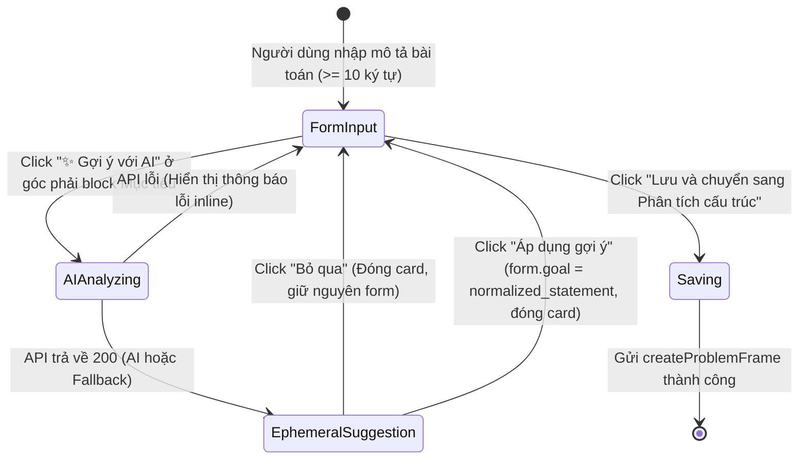

# PHASE 6.2 UI EXECUTION SPEC — AI Problem Structuring UI

> **Mục tiêu:** Tích hợp năng lực phân tích bài toán bằng AI (`POST /api/v1/sessions/{id}/ai/analyze-problem`) vào giao diện `IntakeForm` trong tab `intake` của `SessionDetail`, tuân thủ triệt để nguyên tắc **Human-in-the-Loop** và **AI Trust Contract**.

---

## 1. Problem Statement

Hiện tại:
- Backend Phase 6.2 đã hoàn thiện endpoint `POST /api/v1/sessions/{id}/ai/analyze-problem` với khả năng bóc tách thông số TRIZ, xác định mâu thuẫn, gợi ý từ khóa và tự động fallback sang Rule-based khi cần.
- Tuy nhiên, giao diện `IntakeForm` (`apps/web/features/intake/intake-form.tsx`) chỉ có form nhập tay và gửi trực tiếp qua `createProblemFrame`.
- Người dùng chưa có phương thức để kích hoạt AI phân tích gợi ý trước khi lưu bài toán.

---

## 2. Scope & Boundaries

### Trong phạm vi (In-Scope):
1. **Frontend API Client & Contract Types:**
   - Khai báo TypeScript types trong `apps/web/lib/types.ts`:
     - `AIProblemAnalysisRequest`: `{ raw_statement: string; domain?: string }`
     - `AIProblemAnalysisData`: `{ normalized_statement: string; domain: string | null; contradiction_type: string; improving_parameter: string | null; worsening_parameter: string | null; suggested_keywords: string[]; reasoning: string | null }`
     - `AIProblemAnalysisMeta`: `{ provenance: 'ai_hypothesis' | 'rule_based_fallback'; provider: string; model: string; prompt_version: string; latency_ms: number; fallback_reason: string | null }`
     - `AIProblemAnalysisResponse`: `{ data: AIProblemAnalysisData; _meta: AIProblemAnalysisMeta }`
   - Bổ sung hàm API trong `apps/web/lib/api-client.ts`:
     - `analyzeProblemWithAI(sessionId: string, input: AIProblemAnalysisRequest): Promise<AIProblemAnalysisResponse>`
2. **Component `IntakeForm` Enhancement:**
   - **Vị trí nút Trigger:** Nút `✨ Gợi ý với AI` đặt ở góc phải trên cùng của block **Mục tiêu / Mô tả bài toán** (cùng hàng với nhãn label).
   - **Quản lý trạng thái:** `isAnalyzing` / `aiError` / `suggestion`.
   - **Hiển thị Ephemeral Suggestion Card (Inline):**
     - **Provenance Badge:** Phân biệt rõ `✨ Gợi ý AI (GPT/Gemini)` và `⚡ Phân tích Rule-based (Fallback)`.
     - **Nội dung gợi ý:** Hiển thị `normalized_statement`, `contradiction_type`, `improving_parameter`, `worsening_parameter`, và lý giải `reasoning`.
     - **Keywords:** Hiển thị `suggested_keywords` dưới dạng tags/pills **read-only** để tham khảo (chưa auto-merge vào fields khác trong iteration này).
     - **Nút "Áp dụng gợi ý" (Apply Suggestion):** Thay thế toàn bộ nội dung ô Mục tiêu (`form.goal`) bằng `normalized_statement`.
     - **Nút "Bỏ qua" (Discard):** Đóng card gợi ý mà không thay đổi bất kỳ dữ liệu nào trong form.
3. **AI Trust Contract Guarantees trên UI:**
   - **Chỉ cập nhật Local Form State:** Việc bấm "Áp dụng gợi ý" CHỈ cập nhật state cục bộ của form (`form.goal`).
   - **Không Auto-persist:** Tuyệt đối KHÔNG tự động submit form, KHÔNG gọi `createProblemFrame`, KHÔNG đổi tab, KHÔNG chuyển FSM state của session.
   - Dữ liệu chỉ được lưu vào DB khi người dùng chủ động bấm nút "Lưu và chuyển sang Phân tích cấu trúc".
4. **Test-First Suite:**
   - Unit tests trong `apps/web/lib/__tests__/api-client.test.ts` kiểm thử contract `analyzeProblemWithAI`.
   - Unit & Integration tests trong `apps/web/features/intake/__tests__/intake-form.test.tsx` kiểm thử toàn bộ luồng tương tác UI (Loading, Success AI, Fallback, Error, Apply, Dismiss, No-auto-persist).

### Ngoài phạm vi (Out-of-Scope):
- **Không sửa backend:** Backend endpoint và service Phase 6.2 đã sẵn sàng, không sửa bất kỳ file backend nào.
- **Không auto-merge keywords:** Chưa tự động chèn keywords vào các trường tags khác.
- **Không đụng 10 file untracked out-of-scope.**

---

## 3. UX Flow & State Transitions

### Chi tiết hành vi các trạng thái:
1. **Idle / Typing:**
   - Nút "✨ Gợi ý với AI" bị disable nếu `goal.trim().length < 10` hoặc đang trong quá trình mutation.
2. **AI Analyzing (Loading):**
   - Nút hiển thị spinner `Loader2` kèm text "Đang phân tích...".
   - Form fields không bị reset, nút Lưu chính tạm thời disable để tránh race condition.
3. **Suggestion Rendered:**
   - Card hiển thị inline bên dưới ô textarea Mục tiêu với viền và nền accent nhẹ (`bg-accent/30 border-accent`).
   - Badge hiển thị:
     - `ai_hypothesis`: `bg-primary/10 text-primary border-primary/20`
     - `rule_based_fallback`: `bg-amber-500/10 text-amber-600 border-amber-500/20`
   - Hiển thị tóm tắt thông số TRIZ và lý giải (`reasoning`).
   - `suggested_keywords` hiển thị dạng badge read-only.
4. **Action Semantics:**
   - **Áp dụng gợi ý (Apply):** Gán `form.goal = suggestion.data.normalized_statement`. Đóng card gợi ý. Không kích hoạt `createProblemFrame`, không đổi tab.
   - **Bỏ qua (Discard):** Xóa state `suggestion`, đóng card gợi ý, giữ nguyên 100% nội dung form hiện tại.

---

## 4. Blast Radius Analysis & Affected Files

### Danh sách file dự kiến tác động (Chỉ frontend):
1. `apps/web/lib/types.ts`: Khai báo thêm types cho AI Analysis request/response/meta.
2. `apps/web/lib/api-client.ts`: Khai báo hàm `analyzeProblemWithAI`.
3. `apps/web/features/intake/intake-form.tsx`: Nâng cấp component `IntakeForm`.
4. `apps/web/lib/__tests__/api-client.test.ts`: Thêm test cho API client contract.
5. `apps/web/features/intake/__tests__/intake-form.test.tsx` (Tạo mới): Test suite riêng cho `IntakeForm`.

---

## 5. Acceptance Criteria

1. **AC-1 (API Client Contract):** `analyzeProblemWithAI` gửi đúng payload `POST /api/v1/sessions/{id}/ai/analyze-problem` và deserialize đầy đủ `data` cùng `_meta`.
2. **AC-2 (AI Trigger Placement & State):** Nút "✨ Gợi ý với AI" đặt tại góc phải của block Mục tiêu và chỉ enable khi `goal.trim().length >= 10`.
3. **AC-3 (Loading State):** Khi AI đang phân tích, hiển thị trạng thái loading rõ ràng và không cho phép submit trùng lặp.
4. **AC-4 (AI Provenance):** Phân biệt chính xác nhãn "Gợi ý AI" vs "Quy tắc Fallback" theo trường `_meta.provenance`.
5. **AC-5 (Apply Suggestion):** Khi người dùng click "Áp dụng gợi ý", nội dung `normalized_statement` thay thế toàn bộ nội dung ô Mục tiêu `form.goal`, đóng suggestion card, và CHỈ cập nhật local state.
6. **AC-6 (Discard Suggestion):** Khi click "Bỏ qua", card gợi ý biến mất và nội dung form không bị thay đổi.
7. **AC-7 (AI Trust Contract / No Auto-persist):** Tuyệt đối không gọi `createProblemFrame`, không đổi tab, không đổi FSM state khi phân tích AI hoặc khi bấm "Áp dụng gợi ý".
8. **AC-8 (Zero Quality Regression):** Toàn bộ frontend tests (`npm test --prefix apps/web`) đạt 100% PASS và `npm run type-check --prefix apps/web` không có lỗi.
