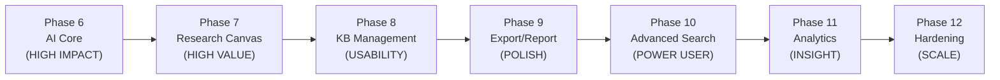

# 🚀 Professional Research Workbench — Upgrade Roadmap

> **Phân tích thực trạng mã nguồn → Lộ trình nâng cấp lên phần mềm nghiên cứu sáng tạo chuyên nghiệp nhất**
> Ngày: 2026-09-30 | Phiên bản mã nguồn được đọc: post-Phase-5.9

---

## 1. ĐÁNH GIÁ THỰC TRẠNG (Baseline)

### Những gì đã xây dựng tốt ✅

| Module | Điểm mạnh |
|---|---|
| **Domain Model** | Chuẩn, rõ ràng: `ResearchSession → ProblemFrame → Contradiction` cascade, có `DocumentStatus`, `SessionStatus` enum, `content_hash` dedup |
| **IngestionService** | Pipeline hoàn chỉnh: FrontmatterParser → SHA256 dedup → MarkdownChunker (tiktoken cl100k_base) → EmbeddingClient → PostgreSQL |
| **RetrievalService** | Hybrid Search tốt: FTS (tsvector + websearch_to_tsquery) + Vector (pgvector cosine) + **RRF fusion** — đây là nền tảng retrieval thực sự xịn |
| **ProblemStructuringService** | Rule-based TRIZ extraction hoạt động, có contradiction matrix, normalize statement |
| **WorkflowEngine** | FSM 6 bước (`idle → structuring → retrieval → ideation → evaluation → synthesis`) có `_VALID_TRANSITIONS`, có prerequisite check |
| **MethodRecommender** | 40 TRIZ Inventive Principles mapping cơ bản |
| **Session Lifecycle** | Archive/Restore (Phase 5.9), soft-delete pattern đúng |
| **Frontend** | Next.js 14 App Router, TanStack Query, session list với tabs, search, archive UX |
| **Infrastructure** | Docker Compose hardened, healthcheck, `service_healthy` condition |

### Những khoảng trống lớn nhất ❌

| Khoảng trống | Mức độ ảnh hưởng |
|---|---|
| **EmbeddingClient = MockEmbeddingClient (zero-vectors)** | Nghiêm trọng: vector search hoàn toàn vô dụng, RRF chỉ dựa vào FTS |
| **TRIZ matrix cực kỳ nhỏ** | 10 cặp thông số, 8 nguyên tắc trong `_PRINCIPLES_MAP` — thiếu 39 parameters và 39 nguyên tắc |
| **Không có AI/LLM layer** | Không có tóm tắt, giải thích, gợi ý thông minh nào từ AI |
| **Không có Note/Insight tracking** | Không lưu được ghi chú, insight trong quá trình nghiên cứu |
| **Không có Export** | Không xuất được session thành PDF, Markdown, hay bất kỳ format nào |
| **Session detail UI chưa có working canvas** | `/sessions/[id]` chỉ có page.tsx rỗng 299 bytes |
| **Không có full TRIZ 39×39 matrix** | Backend `_CONTRADICTION_MATRIX` chỉ có 10 cặp hardcode |
| **Không có visualization** | Không có biểu đồ, mindmap, graph để xem mạng quan hệ của nghiên cứu |
| **Không có multi-document ingest UI** | Chỉ có backend ingestion service, không có UI quản lý knowledge base |

---

## 2. TẦM NHÌN: "Professional Research Workbench"

```
Từ: Tool ghi chú TRIZ cơ bản
Đến: AI-augmented research studio — nơi một kỹ sư/nhà nghiên cứu 
     có thể đi từ "bài toán mơ hồ" → "giải pháp có căn cứ + xuất bản được"
```

### Nguyên tắc thiết kế nâng cấp
1. **Intelligence First** — AI nên cộng hưởng, không thay thế tư duy người dùng
2. **Evidence-Driven** — mọi gợi ý đều phải có trích dẫn nguồn
3. **Progressive Disclosure** — đơn giản lúc bắt đầu, sâu khi cần
4. **Research-Grade Persistence** — không mất dữ liệu, có versioning

---

## 3. ROADMAP NÂNG CẤP (7 Phase)

### PHASE 6 — AI Core Integration 🧠
**Mục tiêu:** Chuyển từ rule-based sang AI-augmented intelligence

#### 6.1 Real Embedding Engine
- **Backend:** Implement `OpenAIEmbeddingClient` (text-embedding-3-small) + `GeminiEmbeddingClient` thay thế `MockEmbeddingClient`
- **Config:** `EMBEDDING_PROVIDER=openai|gemini|local` trong `.env`
- **Lazy upgrade:** Khi có API key → embed thật; khi không có → fallback mock nhưng cảnh báo rõ trong UI
- **Migration:** Script re-embed tất cả chunks hiện có
- **Impact:** Vector search thực sự hoạt động → RRF fusion có ý nghĩa

#### 6.2 LLM Problem Analysis
- **Backend:** `AIAnalysisService` mới với 2 mode:
  - `analyze_problem(raw_statement) → StructuredAnalysis` — LLM phân tích sâu hơn rule-based hiện tại
  - `suggest_keywords(problem_frame) → list[str]` — gợi ý keyword để search KB
- **Prompt engineering:** Prompt template lưu trong DB hoặc file config, có versioning
- **Provider:** Gemini 1.5 Flash (rẻ, nhanh) với fallback rule-based hiện tại
- **Frontend:** Button "Phân tích AI" cạnh submit problem frame, hiển thị diff so với rule-based

#### 6.3 Intelligent TRIZ Recommendation
- **Backend:** Nâng cấp `MethodRecommender`:
  - Import full **TRIZ 39×39 Altshuller Matrix** (1,263 cells)
  - Fallback: LLM gợi ý principles từ normalized statement khi không match matrix
  - Output thêm: `explanation` (tại sao principle này phù hợp), `example` (ví dụ thực tế)
- **Data:** Tạo file `backend/data/triz_matrix_39x39.json` (full matrix từ Altshuller original)
- **Frontend:** Principle card mở rộng với explanation + example + link tài liệu

---

### PHASE 7 — Research Canvas (Session Detail UX) 🎨
**Mục tiêu:** Biến `/sessions/[id]` thành workspace nghiên cứu thực thụ

#### 7.1 Problem Canvas (màn hình chính)
- **Hiện trạng:** `/sessions/[id]/page.tsx` chỉ có 299 bytes placeholder
- **Nâng cấp:**
  - Left panel: Problem Statement editor (intake form đã có, cần wire vào `/sessions/[id]`)
  - Center panel: Normalized statement + Contradiction analysis + TRIZ principles
  - Right panel: Evidence Panel (hybrid search results tự động trigger khi có problem frame)
- **UX:** Auto-save on blur, optimistic updates, `Cmd+Enter` để submit

#### 7.2 Research Notes & Insights
- **Backend:** Model `ResearchNote(id, session_id, content, note_type, created_at)` — đã có type definition trong `types.ts` nhưng chưa có endpoint
  - `note_type: 'insight' | 'hypothesis' | 'decision' | 'question' | 'action'`
  - `POST /api/v1/sessions/{id}/notes`
  - `GET /api/v1/sessions/{id}/notes`
- **Frontend:** Sticky notes panel bên cạnh canvas — người dùng có thể ghi chú inline trong quá trình đọc evidence
- **AI assist:** Button "Tóm tắt insights" → LLM summarize tất cả notes của session

#### 7.3 Workflow Stepper UX
- **Hiện trạng:** `WorkflowStepper` component đã có nhưng canvas chưa render
- **Nâng cấp:**
  - Breadcrumb stepper (6 bước) sticky ở top của session page
  - Mỗi bước có `required_actions` list — checklist những gì cần làm trước khi next step
  - Visual indicator: % completion của bước hiện tại
  - Keyboard shortcut: `Cmd+]` next step, `Cmd+[` back step

#### 7.4 Solution Candidate Tracking
- **Backend:** Model `CandidateSolution` (đã có trong `types.ts` nhưng chưa persist)
  - `POST /api/v1/sessions/{id}/solutions`
  - Status workflow: `candidate → accepted | rejected`
- **Frontend:** Solution board trong tab cuối của session canvas
- **AI:** Button "Đánh giá giải pháp" → LLM đánh giá feasibility + novelty dựa trên KB

---

### PHASE 8 — Knowledge Base Management 📚
**Mục tiêu:** Người dùng quản lý được KB của riêng mình

#### 8.1 Ingestion UI
- **Hiện trạng:** IngestionService chỉ dùng qua CLI/script
- **Backend:** `POST /api/v1/documents` nhận multipart file upload (markdown, txt, pdf)
- **Frontend:** `/knowledge` page — list documents, bulk upload, xem status ingest
- **Features:**
  - Drag-and-drop upload
  - Progress indicator (đang chunk / đang embed)
  - Dedup notification (đã tồn tại)

#### 8.2 Document Viewer
- **Frontend:** Click vào search result → mở Document viewer modal với full content
- **Highlight:** Highlight đoạn excerpt match trong context đầy đủ
- **Action:** Nút "Thêm vào Notes" từ document viewer

#### 8.3 Knowledge Graph Visualization
- **Backend:** `GET /api/v1/knowledge/graph` — trả về nodes (documents/chunks) và edges (semantic similarity score > threshold)
- **Frontend:** Dùng `react-force-graph` hoặc `@xyflow/react` để render:
  - Node = Document, có màu theo topic
  - Edge = similarity relationship
  - Click node → mở document viewer
- **Filter:** Lọc theo topic, phase, golden status

---

### PHASE 9 — Export & Sharing 📤
**Mục tiêu:** Biến kết quả nghiên cứu thành artifact có thể chia sẻ

#### 9.1 Session Export
- **Format hỗ trợ:**
  - **Markdown:** Full session report có frontmatter, problem analysis, principles, notes, solutions
  - **PDF:** Render từ markdown (qua `weasyprint` hoặc `@react-pdf/renderer` frontend)
  - **JSON:** Raw export toàn bộ session data (for import/backup)
- **Backend:** `GET /api/v1/sessions/{id}/export?format=md|pdf|json`
- **Frontend:** Export button trong session header với format picker

#### 9.2 Research Report Generator (AI)
- **LLM task:** Từ session data → tạo research report tự động với cấu trúc:
  - Executive Summary
  - Problem Analysis (TRIZ framing)
  - Evidence & References
  - Recommended Solutions
  - Next Steps
- **Output:** Markdown + có thể convert sang PDF
- **Trigger:** Button "Tạo báo cáo AI" ở cuối session canvas

#### 9.3 Session Import & Templates
- **Import:** Nhập lại session từ JSON export
- **Templates:** Bộ template session có sẵn theo domain (Engineering / Business / Education)
- **Backend:** `POST /api/v1/sessions/import` nhận JSON session dump

---

### PHASE 10 — Advanced Search & Discovery 🔍
**Mục tiêu:** Search thực sự thông minh

#### 10.1 Full TRIZ 39 Parameters Auto-mapping
- **Backend:** Mở rộng `_PARAMETER_KEYWORDS` từ 8 lên 39 parameters (toàn bộ Altshuller parameters)
- **Bilingual:** Mapping tiếng Việt + tiếng Anh cho cả 39 parameters
- **Impact:** Contradiction detection chính xác hơn nhiều

#### 10.2 Cross-Session Knowledge Discovery
- **Backend:** `GET /api/v1/search/cross-session?session_id=X` — tìm các sessions khác có bài toán tương tự
- **Algorithm:** So sánh problem embeddings giữa các sessions
- **Frontend:** "Sessions liên quan" panel trong sidebar của session detail

#### 10.3 Semantic KB Explorer
- **Frontend:** `/search` page riêng với:
  - Query tự nhiên → hybrid search results
  - Filter nâng cao: topic, phase, golden, date range, source type
  - Save search query
  - "Attach to session" — đính kết quả search vào session hiện tại

#### 10.4 Query Expansion with LLM
- **Backend:** Khi user search, LLM tự động expand query:
  - Thêm từ đồng nghĩa tiếng Việt + Anh
  - Suggest related TRIZ terms
- **Config:** `QUERY_EXPANSION=enabled|disabled`

---

### PHASE 11 — Analytics & Research Intelligence 📊 ✅ (COMPLETED)
**Mục tiêu:** Nhìn thấy được patterns trong nghiên cứu của mình qua Dashboard trực quan, contextual deep links, semantic landmarks và phản hồi tương tác đầy đủ.

#### 11.1 Overview & Architecture (11.1A & 11.1B) ✅
- **Backend:** `GET /api/v1/analytics/overview` tổng hợp toàn diện chỉ số: Sessions, Content, Solutions, Knowledge Base, TRIZ, kèm Postgres testcontainer suite (`test_analytics_overview_api.py`).
- **Frontend:** `/analytics` page với `AnalyticsDashboard` component, TanStack Query, loading skeleton, error retry.

#### 11.2 Discoverability & Navigation (11.2, 11.3, 11.4) ✅
- **Header & Navbar:** Contextual deep links đến `/sessions`, `/knowledge`, `/search`.
- **Section Headers:** Link điều hướng theo ngữ cảnh trên từng tiêu đề breakdown section.

#### 11.3 Empty States & Quality Indicators (11.5, 11.6, 11.8) ✅
- **Global Empty State:** Actionable Empty-State Guidance Panel khi toàn bộ hệ thống chưa có dữ liệu.
- **Local Empty States:** Guidance cục bộ theo từng breakdown khi dữ liệu rỗng một phần.
- **Golden Document Ratio:** Badge tỷ lệ tài liệu chuẩn hóa trên tổng số tài liệu tri thức.

#### 11.4 Accessibility, Symmetry & Feedback Hardening (11.7, 11.9, 11.10, 11.11) ✅
- **KPI Card Drilldowns:** Link chuyên sâu ở chân 4 thẻ chỉ số KPI.
- **Semantic Landmarks:** `<section aria-labelledby="...">` và các data-testid ổn định.
- **TRIZ Subtitle Symmetry:** Subtitle động theo phân loại mâu thuẫn kỹ thuật/vật lý.
- **Refresh Feedback:** Nút làm mới với nhãn động `Đang làm mới...`, `aria-busy`, `aria-label`, `data-testid="analytics-refresh-button"`.
- **Tài liệu đặc tả:** Chi tiết tại `docs/PHASE_11_ANALYTICS_SPEC.md` và `docs/PHASE_11_ANALYTICS_GHERKIN_MATRIX.md`.

---

### PHASE 12 — Quality & Performance Hardening 🔧
**Mục tiêu:** Production-grade reliability

#### 12.1 IVFFlat Index for pgvector
- **Hiện trạng:** Code có comment "Tạo AFTER ingest đủ dữ liệu (min ~1000 rows)" nhưng chưa có migration
- **Action:** Tạo Alembic migration tạo IVFFlat index khi `chunks >= 1000`
- **Impact:** Query vector search từ O(n) → O(log n)

#### 12.2 Async Background Processing
- **Use case:** Khi ingest file lớn hoặc re-embed toàn bộ KB → không block HTTP request
- **Solution:** Celery + Redis (hoặc FastAPI BackgroundTasks cho use case nhỏ)
- **Frontend:** Progress indicator cho ingest jobs

#### 12.3 Caching Layer
- **Redis cache:** Cache kết quả search thường xuyên (TTL 5 phút)
- **Frontend:** SWR-style stale-while-revalidate qua TanStack Query đã có, cần tune `staleTime`

#### 12.4 Comprehensive Alembic Migrations
- **Hiện trạng:** Không có Alembic setup, schema tạo qua `metadata.create_all`
- **Action:** Khởi tạo Alembic, tạo initial migration từ current schema, tạo workflow cho future changes
- **Constraint:** Không thay đổi schema hiện tại, chỉ add Alembic wrapper

---

## 4. THỨ TỰ ƯU TIÊN THỰC HIỆN



### Ma trận Impact × Effort

| Phase | Business Impact | Effort | Priority |
|---|---|---|---|
| **6.1** Real Embeddings | 🔴 Critical | Medium | **#1** |
| **7.1** Problem Canvas | 🔴 Critical | Medium | **#2** |
| **6.2** LLM Problem Analysis | 🟠 High | Medium | **#3** |
| **7.2** Research Notes | 🟠 High | Low | **#4** |
| **9.1** Export Markdown/PDF | 🟠 High | Low | **#5** |
| **6.3** Full TRIZ Matrix | 🟡 Medium | Low | **#6** |
| **8.1** Ingestion UI | 🟡 Medium | Medium | **#7** |
| **9.2** AI Report Generator | 🟡 Medium | Medium | **#8** |
| **10.1** Full 39 Parameters | 🟡 Medium | Low | **#9** |
| **7.4** Solution Tracking | 🟡 Medium | Medium | **#10** |
| **11.1** Analytics Dashboard | 🟢 Nice-to-have | Medium | ✅ **Hoàn tất** (11.1A → 11.11) |
| **8.3** Knowledge Graph | 🟢 Nice-to-have | High | #12 |
| **12.4** Alembic | 🟢 Tech debt | Medium | #13 |
| **12.1** IVFFlat Index | 🟢 Performance | Low | #14 |

---

## 5. RÀNG BUỘC BẤT BIẾN (Carried Forward)

> Những ràng buộc này KHÔNG THAY ĐỔI qua tất cả phase mới:

1. ✅ Không hard delete bất kỳ entity nào — chỉ soft delete / archive
2. ✅ Không thay đổi `backend/uv.lock` trừ khi thêm dependency mới được phê duyệt
3. ✅ Không sửa schema database mà không có migration rõ ràng
4. ✅ Không đụng legacy code (`apps/api/`, `frontend/`)
5. ✅ Mọi phase mới phải có test trước khi code (test-first)
6. ✅ Session data persistence 100% — không được mất data user

---

## 6. QUICK WINS (CÓ THỂ BẮT ĐẦU NGAY)

Những việc nhỏ, impact lớn, không cần approval architecture:

| # | Việc cần làm | Effort | File liên quan |
|---|---|---|---|
| QW-1 | Import full 39×39 TRIZ matrix JSON | 2h | `backend/data/triz_matrix.json` + `method_recommender.py` |
| QW-2 | Full 39 TRIZ parameters bilingual mapping | 2h | `problem_structuring_service.py` |
| QW-3 | Wire `/sessions/[id]` page → Problem Canvas component | 3h | `apps/web/app/sessions/[id]/page.tsx` |
| QW-4 | Add `ResearchNote` model + CRUD endpoints | 4h | `models.py` + `sessions.py` |
| QW-5 | Export session as Markdown | 3h | New endpoint `GET /sessions/{id}/export` |
| QW-6 | OpenAI/Gemini embedding client | 4h | `ingestion_service.py` + env config |
| QW-7 | IVFFlat pgvector index migration | 1h | Alembic migration file |

---

## 7. ĐỊNH NGHĨA "PROFESSIONAL RESEARCH WORKBENCH"

Khi hoàn tất Phase 6–9, hệ thống đạt được:

```
✅ Người dùng có thể:
   1. Nhập bài toán phức tạp bằng tiếng Việt tự nhiên
   2. Nhận phân tích AI về loại mâu thuẫn (TRIZ technical/physical)
   3. Xem gợi ý từ TRIZ 39×39 matrix đầy đủ + explanation từ AI
   4. Tìm kiếm semantic trong KB với kết quả thực sự có nghĩa (real embeddings)
   5. Ghi notes và insights inline trong quá trình nghiên cứu
   6. Theo dõi workflow 6 bước từ intake → synthesis
   7. Xuất kết quả thành báo cáo Markdown/PDF có thể chia sẻ
   8. Quản lý KB riêng qua UI upload tài liệu
   9. Xem analytics về pattern nghiên cứu của mình

🎯 Benchmark chất lượng:
   - Vector search latency < 100ms (với IVFFlat index)
   - Problem analysis accuracy > 85% (AI-augmented vs 80% rule-based hiện tại)
   - Recall@5 trên golden set > 0.85 (với real embeddings vs 0.75 target hiện tại)
   - Export sang Markdown trong < 2 giây
   - Zero data loss (soft delete everywhere)
```
